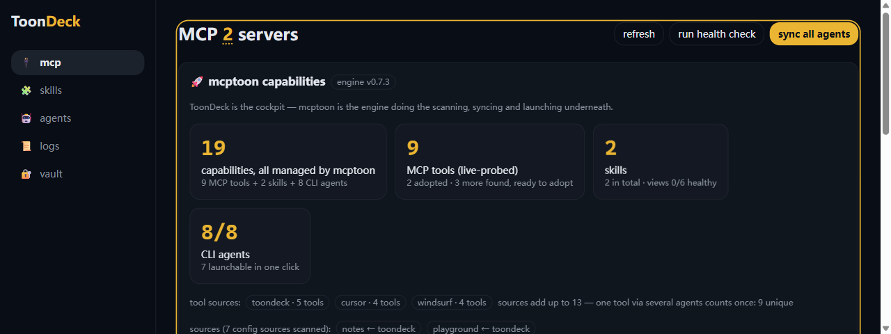
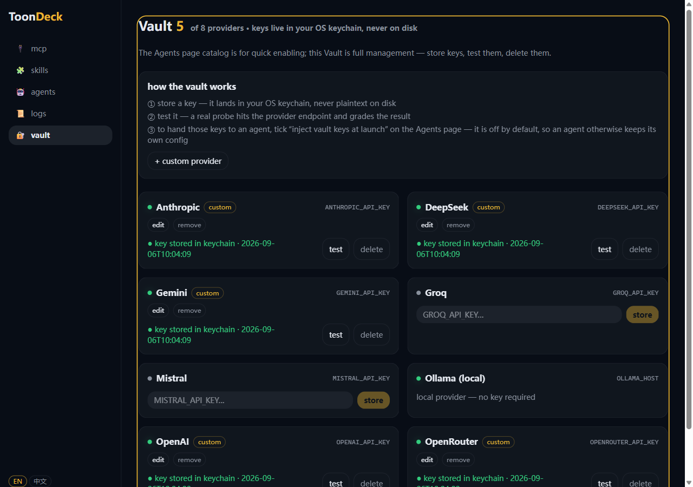
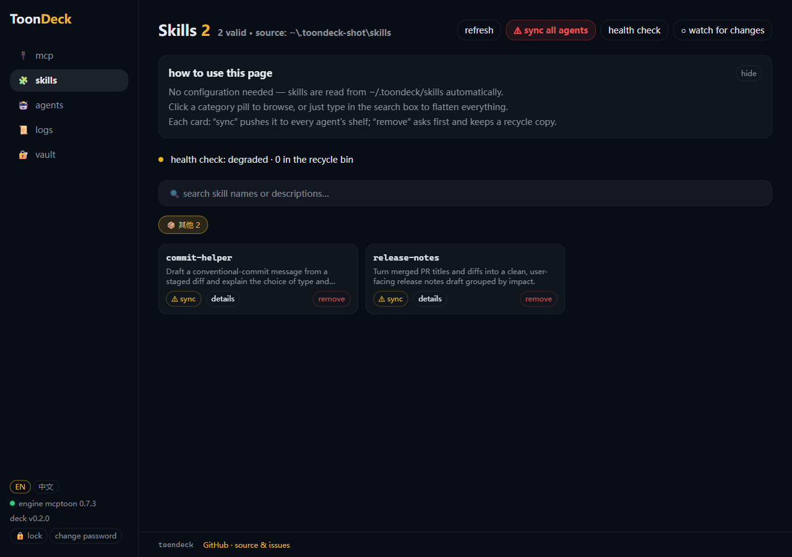

# ToonDeck

> One deck for every agent — all your MCP tools, skills, models and API keys,
> configured once, running everywhere.

English | [简体中文](README.zh-CN.md)

[](https://github.com/activeing123/toondeck/actions/workflows/ci.yml)
[](https://pypi.org/project/toondeck/)


**Status: pre-alpha.** Works on your own machine; expect rough edges before a
1.0. Powered by [mcptoon](https://github.com/activeing123/mcptoon), which is
pulled in automatically as a dependency.



| Vault — keys in your OS keychain, never on disk | Skills — one folder, synced to every agent |
| --- | --- |
|  |  |

## Requirements

- Python **3.10 or newer**
- Windows, macOS or Linux
- API keys live in your **OS keychain** (never in a plaintext file). On a
  headless Linux box you need a keychain service (GNOME Keyring / KWallet);
  without one, ToonDeck refuses to store a key rather than writing it to disk.

## Install

From source — works today:

```bash
git clone https://github.com/activeing123/toondeck.git
cd toondeck
pip install .
toondeck          # starts the local console and opens your browser
```

From PyPI — not published yet, so this currently fails:

```bash
pip install toondeck   # coming soon
```

The web UI is **shipped inside the package**, so a source install needs no
node, no `pnpm`, and no build step.

## What you get

| Page | What it does |
| --- | --- |
| **MCP** | every MCP server in one place: health, tools, toggle, sync to all agents |
| **Skills** | one skill folder, linked into every agent that supports skills |
| **Agents** | auto-detects installed coding agents, launches/stops them, sets their model and API source |
| **Logs** | live terminal for whatever the deck started |
| **Vault** | API keys per provider, stored in the OS keychain, with a real probe |

## Development

```bash
# backend
python -m venv .venv && source .venv/bin/activate   # Windows: .venv\Scripts\activate
pip install -e ".[dev]"
pytest

# frontend (builds straight into src/toondeck/deck/api/webui, which is committed
# so installed copies carry their own UI — rebuild and commit together)
cd web && pnpm install && pnpm test && pnpm build
```

CI runs the backend and web suites on Linux plus a **clean-room job** that
builds the wheel, installs it into a fresh virtualenv and proves the UI and the
detection catalogs actually ship — the class of bug that local tests cannot see.
Reproduce it locally before tagging:

```bash
python scripts/clean_room_check.py
```

## Security

API keys never touch disk and never leave your machine — the full model, and
how to report a vulnerability privately, is in
[SECURITY.md](.github/SECURITY.md).

## Contributing

The short version: every fix ships with a gate, and the clean-room script is the
boss. Details in [CONTRIBUTING.md](CONTRIBUTING.md).

License: Apache-2.0
