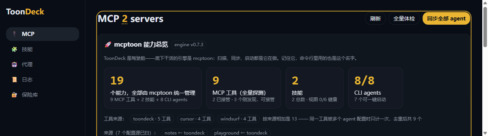
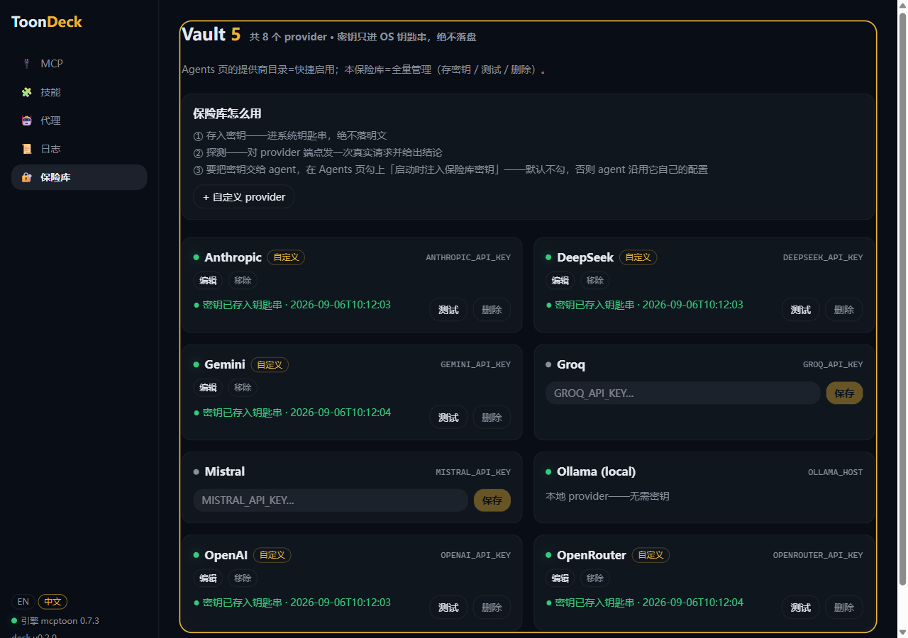
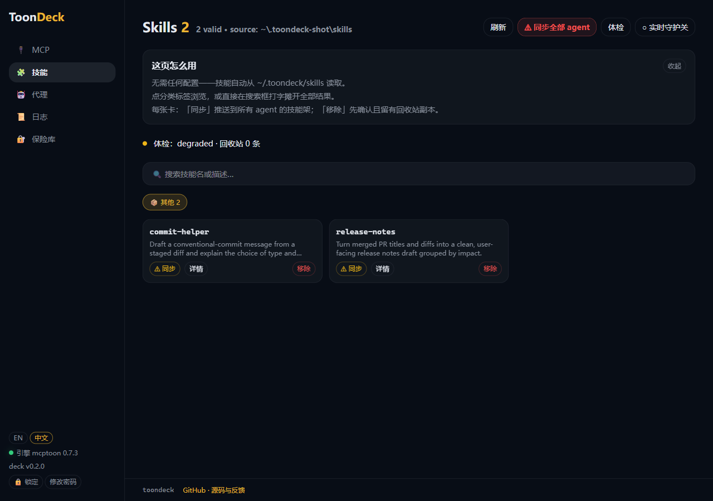

# ToonDeck

> 一个面板管所有 agent——MCP 工具、技能、模型、API 密钥，配置一次，处处可用。

[English](README.md) | 简体中文

[](https://github.com/activeing123/toondeck/actions/workflows/ci.yml)
[](https://pypi.org/project/toondeck/)


**状态：pre-alpha。** 在你自己的机器上运行；1.0 之前难免粗糙。由
[mcptoon](https://github.com/activeing123/mcptoon) 驱动，它会作为依赖自动安装。



| 保险库——密钥进系统钥匙串，绝不落盘 | 技能——一个目录，同步给所有 agent |
| --- | --- |
|  |  |

## 环境要求

- Python **3.10 或更新**
- Windows 是一等公民（控制台会在真实终端窗口里启动 agent）；macOS 和 Linux
  也可用
- API 密钥保存在**操作系统钥匙串**里（绝不写入明文文件）。无桌面的 Linux
  机器需要钥匙串服务（GNOME Keyring / KWallet）；没有的话，ToonDeck 会拒绝
  存密钥并告诉你原因，而不是悄悄写进磁盘。

## 安装

从源码装——现在就能用：

```bash
git clone https://github.com/activeing123/toondeck.git
cd toondeck
pip install .
toondeck          # 启动本地控制台并打开浏览器
```

从 PyPI 装——还没发布，目前这条命令会失败：

```bash
pip install toondeck   # 即将上线
```

Web UI **随包发布**，源码安装不需要 node、不需要 pnpm、没有任何构建步骤。

## 你会得到什么

| 页面 | 它做什么 |
| --- | --- |
| **MCP** | 所有 MCP 服务器集中一处：健康状态、工具、开关、一键同步给所有 agent |
| **技能** | 一个技能目录，链接进每个支持技能的 agent |
| **代理** | 自动检测已安装的编码 agent，启动/停止，切换模型和 API 来源 |
| **日志** | 面板启动的一切都有实时终端 |
| **保险库** | 每个 provider 一把密钥，存进系统钥匙串，配真实探测 |

## 开发

```bash
# 后端
python -m venv .venv && source .venv/bin/activate   # Windows: .venv\Scripts\activate
pip install -e ".[dev]"
pytest

# 前端（构建产物直接进 src/toondeck/deck/api/webui；该目录随包提交，
# 所以改了 UI 必须重新构建并一起提交）
cd web && pnpm install && pnpm test && pnpm build
```

CI 在 Linux 上跑后端与前端测试，外加一个**净室 job**：构建 wheel、装进全新
虚拟环境、证明 UI 和检测目录真的随包发布——这类 bug 本地测试看不见。打
tag 前可在本地复现：

```bash
python scripts/clean_room_check.py
```

## 安全

API 密钥不落盘、不离开你的机器——完整的安全模型，以及漏洞私下报告的入口，
见 [SECURITY.md](.github/SECURITY.md)。

## 参与贡献

简短版：每个修复都要配一道门禁，净室脚本是最终裁判。细节见
[CONTRIBUTING.md](CONTRIBUTING.md)。

许可证：Apache-2.0
